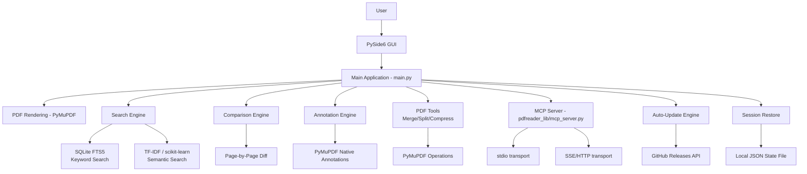
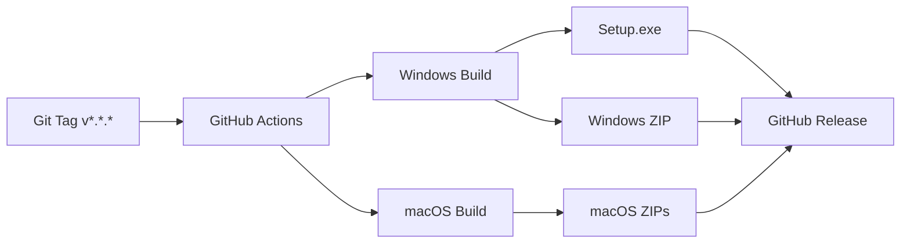

# Architecture

## Overview

OpenReader is a **local-first desktop PDF utility** built with Python, PySide6 (Qt 6), and PyMuPDF. All PDF processing happens on the local machine — no network services, no uploads, no telemetry.

## High-Level Architecture



## Components

### 1. Main Application (`main.py`)

The entry point and primary application class. A single-file PySide6 application that:

- Manages the main window, menu bar, toolbar, and status bar
- Handles tab management (open, close, reorder)
- Orchestrates PDF loading, rendering, and navigation
- Coordinates search, annotation, and PDF tool operations
- Manages session persistence and workspace restore
- Runs the auto-update check on launch

Size: ~4,800 lines. This is intentionally monolithic for maintainability — the GUI logic is tightly coupled and splitting would add indirection without clear benefit at the current scale.

### 2. Core Library (`pdfreader_lib/`)

A Python package containing shared logic extracted from `main.py`:

- **search.py** — Full-document keyword search, SQLite FTS5 library index, TF-IDF semantic search
- **comparison.py** — Page-by-page PDF comparison with color-coded diff output
- **pdf_tools.py** — Merge, split, extract, and compress operations
- **mcp_server.py** — MCP protocol server for AI agent integration (14 tools)

### 3. Search Engine

Three-tier search architecture:

| Layer | Technology | Scope | Use Case |
|-------|-----------|-------|----------|
| Keyword | Built-in text extraction + regex | Single PDF | Quick find-in-page |
| Library FTS5 | SQLite FTS5 + BM25 ranking | Cross-document folder | Full-text search across library |
| Semantic | TF-IDF cosine similarity (scikit-learn) | Indexed library | Meaning-based matching |

### 4. PDF Rendering

PyMuPDF (MuPDF bindings) handles all PDF I/O:

- Page rendering to QPixmap for display
- Text extraction for search and copy
- Annotation creation and management
- Document metadata access
- Page count, size, and structure information

### 5. Comparison Engine

Side-by-side diff view comparing two PDFs page-by-page:

- Extracts text from corresponding pages
- Computes word-level diffs using Python's `difflib`
- Renders color-coded output (red = deletion, green = insertion)
- Displays diff summary statistics

### 6. MCP Server

Optional AI agent integration via the Model Context Protocol:

- **Transport:** stdio (default) or SSE/HTTP
- **Tools:** 14 programmatic PDF operations
- **Scope:** All core PDF operations exposed as tools
- **Dependency:** Requires `mcp` SDK (separate requirements file)

### 7. Update Detection (v1.2.0+)

Checks GitHub Releases API on launch:

- Compares latest tag against packaged version
- **No download or install** — shows "Open Releases Page" dialog or status bar message
- Updates applied via Microsoft Store (future) or manual MSIX download
- Self-update pipeline removed in v1.2.0 (see `docs/updater-architecture.md`)

## Data Flow

```
PDF File on Disk
    │
    ▼
PyMuPDF.open() ──► Validation checks (size, header, page limits)
    │
    ├──► Page rendering ──► QPixmap cache ──► Display
    │
    ├──► Text extraction ──► Search index / Copy buffer
    │
    ├──► Annotation engine ──► PDF modification ──► Save
    │
    └──► PDF tools ──► New PDF file on disk
```

## Security Architecture

- **No network egress** — the only network call is the GitHub Releases API check for updates
- **Input validation** — file type, size, header, and render limits enforced before processing
- **Dependency scanning** — Bandit (static analysis) and pip-audit (vulnerability check) in CI
- **Dependabot** — weekly dependency update monitoring
- **Local-first** — all data stays on the local filesystem

## Session Persistence

```json
{
  "open_files": ["path/to/doc1.pdf", "path/to/doc2.pdf"],
  "active_tab": 0,
  "page_positions": { "path/to/doc1.pdf": 3, "path/to/doc2.pdf": 7 },
  "restore_on_launch": true
}
```

Stored in `%APPDATA%\Sparsh\OpenReader\session.json` (Windows) or `~/Library/Application Support/` (macOS).

## OCR Integration

PyMuPDF integrates with Tesseract for OCR on scanned/image-based PDFs:

- Triggered on text selection when no embedded text is found
- Requires Tesseract to be installed on the system (not bundled)
- Small in-memory OCR page cache to avoid repeated processing

## Platform Support

| Platform | Status | Notes |
|----------|--------|-------|
| Windows | **Stable** (primary target) | Packaged builds via PyInstaller + Inno Setup |
| macOS | Source-build only | Not stable. Known UI and packaging issues |
| Linux | Not supported | No plans currently |

## Build Pipeline


