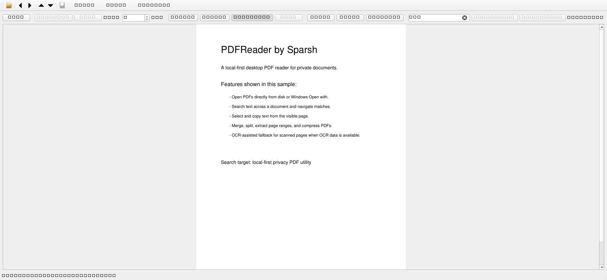

<p align="center">
  
</p>

<h1 align="center">PDFReader by Sparsh</h1>

<p align="center">
  A local-first, non-commercial desktop PDF reader for Windows and macOS source builds.
  <br>
  Read, search, copy, merge, split, extract, and compress PDFs without uploading documents anywhere.
</p>

<p align="center">
  <a href="https://github.com/sparshsam/pdfreader-by-sparsh/releases/latest"></a>
  <a href="LICENSE"></a>
  <a href="https://github.com/sparshsam/pdfreader-by-sparsh/actions/workflows/build-windows.yml"></a>
  <a href="https://github.com/sparshsam/pdfreader-by-sparsh/actions/workflows/build-macos.yml"></a>
  <a href="https://github.com/sparshsam/pdfreader-by-sparsh/actions/workflows/security.yml"></a>
</p>

<p align="center">
  <a href="#download">Download</a>
  ·
  <a href="#features">Features</a>
  ·
  <a href="#screenshots">Screenshots</a>
  ·
  <a href="#build-from-source">Build from Source</a>
  ·
  <a href="#security-and-privacy">Security</a>
</p>

## Overview

PDFReader by Sparsh is a practical desktop PDF utility built with Python, PySide6, and PyMuPDF. It is designed for people who want common PDF tasks in a simple native app without sending private documents to a cloud service.

The app is intentionally local-first: PDFs are opened, rendered, searched, merged, split, and compressed on your computer.

## Download

Get the latest builds from the [Releases page](https://github.com/sparshsam/pdfreader-by-sparsh/releases/latest).

| Platform | Download | Notes |
|---|---|---|
| Windows | `PDFReader.by.Sparsh.exe` | One-file executable. Python is not required. |
| macOS Apple Silicon | `PDFReader-by-Sparsh-macOS-Apple-Silicon.zip` | Unsigned app bundle. Gatekeeper may require manual approval. |
| macOS Intel | `PDFReader-by-Sparsh-macOS-Intel.zip` | Unsigned app bundle. Gatekeeper may require manual approval. |

Windows may show a SmartScreen warning because community builds are not code-signed. macOS may show a Gatekeeper warning because the Mac builds are not Apple-notarized. Only run software from sources you trust.

## Features

| Category | Capabilities |
|---|---|
| Reading | Open PDFs, one-page view, previous/next navigation, page jump, fit-width, zoom in/out |
| Search | Full-document text search, match count, next/previous result navigation |
| Copying | Drag-select text from the visible page and copy with `Ctrl+C` or the Copy button |
| OCR fallback | Attempts OCR-assisted selection on scanned/image-based pages when Tesseract OCR data is available |
| PDF tools | Merge PDFs, split every page, extract page ranges like `1-3,5`, save compressed copies |
| Desktop integration | Windows "Open with" support, last-folder memory with `QSettings`, custom app icon |
| Release engineering | PyInstaller packaging, Windows/macOS GitHub Actions builds, dependency/security checks |

## Screenshots

### Main Window


### Search View



## Why I Built This

I built PDFReader by Sparsh as a local-first alternative for reading and handling PDFs without uploading private documents to cloud services. The project helped me practice desktop GUI development, PDF processing, OCR fallback handling, packaging, release automation, and security hardening while creating a tool people can actually use.

## Security and Privacy

PDFReader by Sparsh processes PDFs locally. It does not use network services and does not upload PDFs.

The app includes lightweight safety checks before opening and rendering documents:

- Accepts `.pdf` files only.
- Checks for a PDF header before parsing.
- Rejects empty files and files over 500 MB.
- Rejects pages outside the supported page-size limit.
- Caps render pixel allocation to reduce PDF-bomb/OOM risk.
- Limits all-pages search result storage.
- Keeps only a small OCR page cache in memory.
- Runs `pip-audit` and Bandit in CI.

These checks reduce risk from malformed or oversized PDFs, but PDF parsing still depends on PyMuPDF/MuPDF. Avoid opening PDFs from untrusted sources unless you use OS-level sandboxing, a VM, or another isolation layer.

## License and Use

PDFReader by Sparsh is free to use, share, study, and modify for non-commercial purposes under the [PolyForm Noncommercial License 1.0.0](LICENSE).

Commercial use, resale, paid redistribution, or bundling in a commercial product is not permitted without separate written permission from the copyright holder.

Earlier published versions may have been released under MIT. The current license applies from the license change forward.

## Requirements

| Use case | Requirements |
|---|---|
| Run Windows release | Windows. Python is not required. |
| Run macOS release | macOS. Apple Silicon or Intel build must match your Mac. |
| Develop/build locally | Python 3.11 or newer |

## Build From Source

### Windows

```powershell
python -m venv .venv
.\.venv\Scripts\Activate.ps1
python -m pip install -r requirements.txt
python main.py
```

Build the Windows executable:

```powershell
.\scripts\build_windows.ps1
```

Output:

```text
dist\PDFReader by Sparsh.exe
```

### macOS

The Windows `.exe` cannot run on macOS. PyInstaller bundles native binaries for the operating system it runs on, so Mac users need a macOS build.

```bash
git clone https://github.com/sparshsam/pdfreader-by-sparsh.git
cd pdfreader-by-sparsh
chmod +x scripts/build_macos.sh
./scripts/build_macos.sh
```

Output:

```text
dist/PDFReader by Sparsh.app
```

See [docs/macos.md](docs/macos.md) for macOS setup, Finder "Open With" notes, icon generation, OCR notes, and signing/notarization caveats.

## Use as Default PDF App

Windows does not allow apps to silently take over file defaults. To make this your default PDF app:

1. Right-click a PDF file.
2. Choose **Open with > Choose another app**.
3. Pick `PDFReader by Sparsh.exe`.
4. Select **Always use this app to open .pdf files**.
5. Click **OK**.

## OCR Notes

Normal text selection works for PDFs that already contain text.

For scanned/image-only PDFs, the app attempts OCR through PyMuPDF's Tesseract integration. If Tesseract OCR data is not available on the computer, the app shows a clear message and continues working for normal PDFs.

## Roadmap

- Dark mode
- Recent files list
- Multi-tab PDF support
- Highlight and annotation tools
- Better OCR setup instructions
- Windows installer package
- Code signing for smoother public downloads
- Stronger sandboxing guidance for hostile/untrusted documents

## Project Structure

```text
.
├── .github/                 # CI, security checks, Dependabot
├── assets/                  # App icon and README screenshots
├── docs/                    # Platform notes
├── scripts/                 # Build scripts
├── tools/                   # Developer utilities, including icon generation
├── main.py                  # Main PySide6 application
├── requirements.txt         # Pinned runtime/build dependencies
├── PDFReader by Sparsh.spec # PyInstaller spec
├── CHANGELOG.md
├── CONTRIBUTING.md
├── LICENSE
└── SECURITY.md
```

## Contributing

Contributions are welcome for non-commercial use cases. Please read [CONTRIBUTING.md](CONTRIBUTING.md) and [SECURITY.md](SECURITY.md) before opening issues or pull requests.
