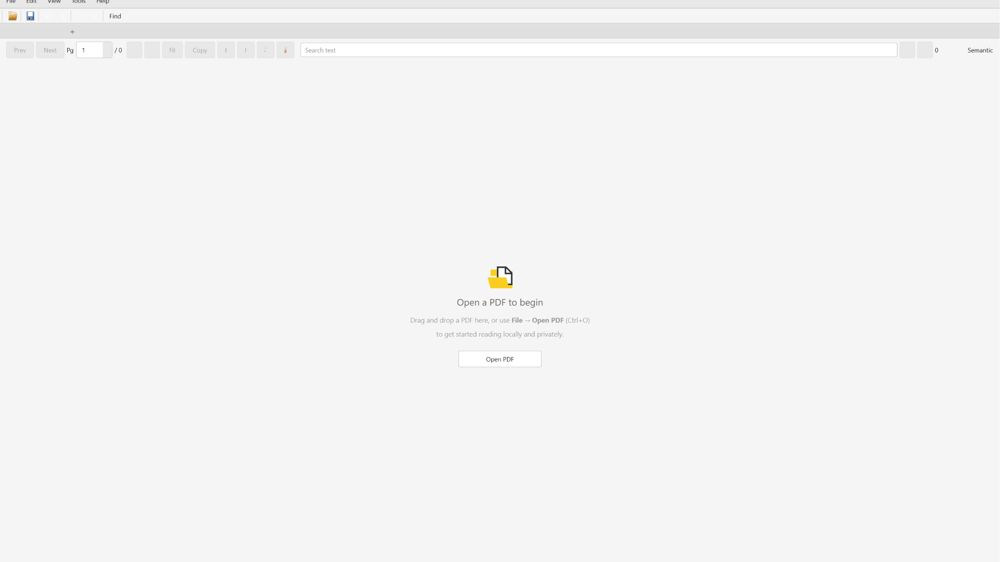
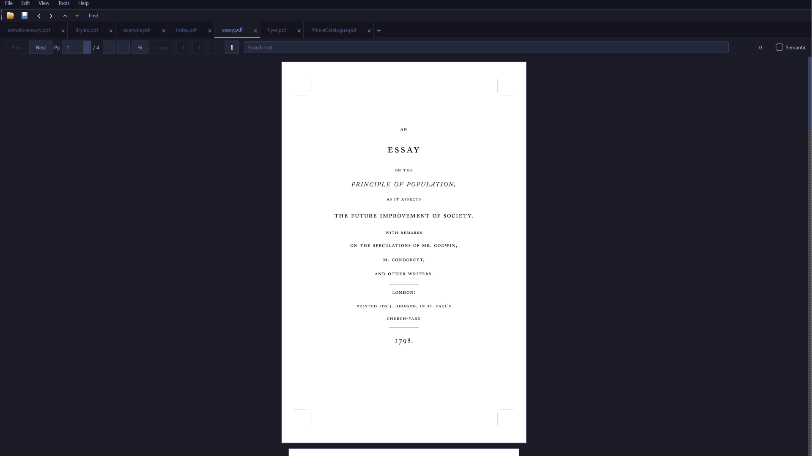
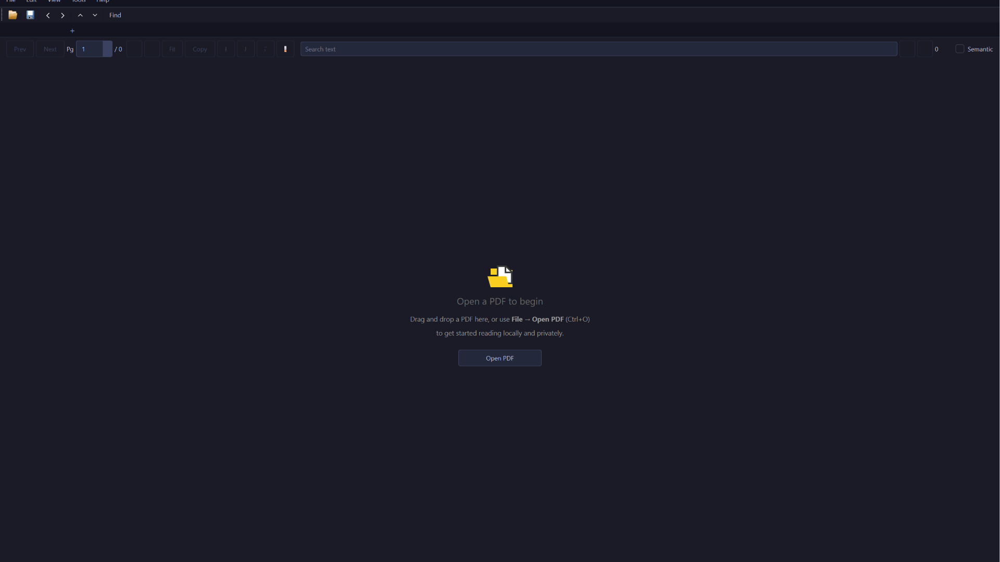
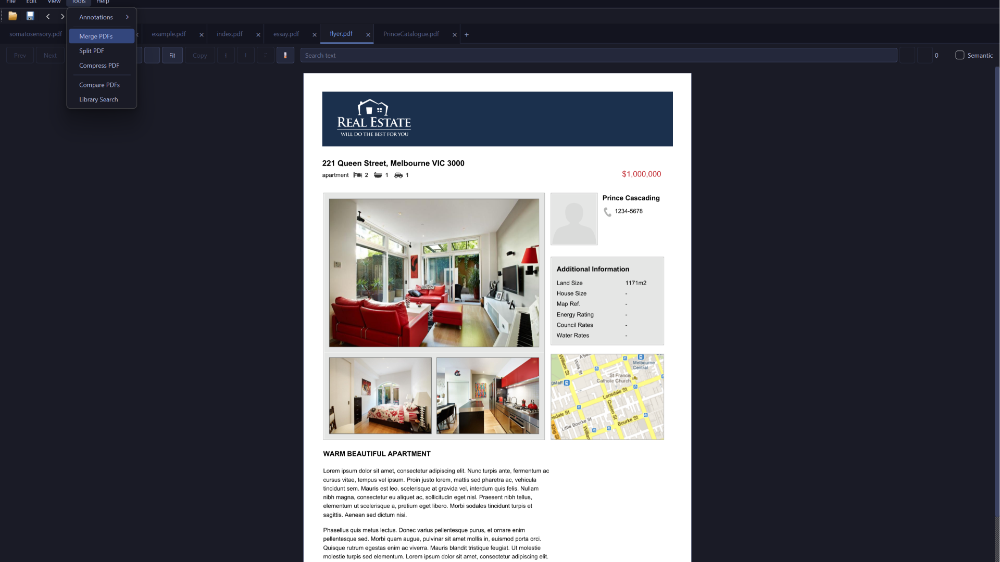
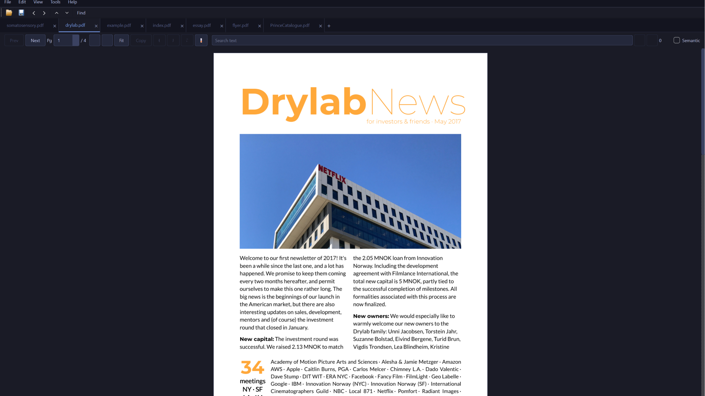

<p align="center">
  
</p>

<h1 align="center">OpenReader</h1>

<p align="center">
  Privacy-first PDF tools for humans and AI agents — entirely local.
  <br>
  Read, search, compare, merge, split, extract, and compress PDFs without uploading documents anywhere.
</p>

<p align="center">
  <a href="https://github.com/sparshsam/pdfreader-by-sparsh/releases/latest"></a>
  <a href="LICENSE"></a>
  <a href="https://github.com/sparshsam/pdfreader-by-sparsh/actions/workflows/ci.yml"></a>
  <a href="#"></a>
  <a href="#download"></a>
</p>

---

## Overview

OpenReader is a **local-first PDF utility** that works with AI agents.

Every operation — reading, searching, annotating, compressing, comparing, merging, splitting — runs on your machine. No accounts. No subscriptions. No telemetry. No cloud uploads.

### Three ways to use OpenReader

| If you want to… | Use… |
|---|---|
| Open PDFs, search, annotate, merge, split | The desktop GUI |
| Ask an AI questions about a PDF | The built-in MCP server + any MCP-compatible agent |
| Automate batch PDF workflows | The MCP server from scripts |

---

## Download

### Microsoft Store (Recommended)

The Store submission is in certification. Once approved, install with one click — automatic updates included.

*Store link will appear here after certification.*

### GitHub Releases (Advanced Users)

MSIX packages are available on the [Releases page](https://github.com/sparshsam/pdfreader-by-sparsh/releases).

| Platform | Package | Notes |
|---|---|---|
| Windows 10/11 | `OpenReader.msix` | MSIX package. May be unsigned — requires [Developer Mode](https://learn.microsoft.com/en-us/windows/apps/get-started/enable-your-device-for-development) for sideloading. |
| Windows 10/11 | `OpenReader-Setup.exe` | Legacy installer for manual recovery. Requires administrator rights. |
| Windows 10/11 | `OpenReader-Windows.zip` | Portable ZIP. |
| macOS | `OpenReader-macOS-*.zip` | **Experimental.** See [macOS notes](docs/macos.md). |
| Linux | — | Unsupported. |

### Platform Support

| Platform | Status |
|---|---|
| Windows 10/11 | Supported |
| Microsoft Store | In certification — recommended after approval |
| GitHub MSIX | Advanced users |
| macOS Apple Silicon | Experimental |
| macOS Intel | Experimental |
| Linux | Unsupported |

### Update Policy

OpenReader does not install updates itself.

- **Microsoft Store** installations update automatically through the Store.
- **GitHub MSIX** installations: Help → Check for Updates opens the releases page. Download and install manually.
- **Source builds**: `git pull` and rebuild.

---

## AI Agent Integration (MCP Server)

OpenReader ships with a built-in [MCP (Model Context Protocol)](https://modelcontextprotocol.io) server. Any MCP-compatible agent — Claude Code, Claude Desktop, Hermes, or others — can interact with PDFs directly on your machine.

No cloud, no API keys, no document uploads.

### What you can do with AI agents

| Workflow | What happens |
|---|---|
| **Ask questions about a PDF** | Agent extracts text from any page and answers. |
| **Search entire PDF libraries** | Agent indexes a folder and searches across all documents (keyword or semantic). |
| **Compare document versions** | Agent runs a side-by-side diff and gives you a structured summary. |
| **Summarize research collections** | Agent reads multiple PDFs and synthesizes findings. |
| **Build automated PDF pipelines** | Write scripts that merge, split, compress, and extract — all local. |

### Architecture

```
┌─────────────────────────────────────────────────────┐
│  Claude / Hermes / any MCP-compatible agent          │
│  (asks questions, runs searches, compares docs)       │
└──────────┬──────────────────────────────────────────┘
           │ MCP protocol (stdio or SSE)
           ▼
┌─────────────────────────────────────────────────────┐
│  OpenReader MCP Server                               │
│  pdfreader_lib/mcp_server.py                         │
│  14 tools: extract, search, compare, merge, split…   │
└──────────┬──────────────────────────────────────────┘
           │ local file access only
           ▼
┌─────────────────────────────────────────────────────┐
│  Your PDFs (stored on your machine)                   │
└─────────────────────────────────────────────────────┘
```

### Quick setup

```bash
# Install MCP dependencies
pip install -r requirements-mcp.txt
```

Add to your MCP-compatible agent's configuration:

```json
{
  "mcpServers": {
    "openreader": {
      "command": "python",
      "args": ["-m", "pdfreader_lib.mcp_server"]
    }
  }
}
```

The server runs over stdio by default. For HTTP/SSE transport:

```bash
python -m pdfreader_lib.mcp_server --transport sse --port 8312
```

All operations are local. No data is uploaded anywhere.

---

## Features

| Category | Capabilities |
|---|---|
| Reading | Open PDFs, one-page view, previous/next navigation, page jump, fit-width, zoom in/out |
| Multi-tab | Open several documents in a single window with movable, closeable tabs. Ctrl+T new tab, Ctrl+W close tab, Ctrl+Shift+W close all |
| Session restore | Remembers open PDFs and page positions across restarts. Auto or manual restore (File menu toggle) |
| Search (keyword) | Full-document text search, match count, next/previous result navigation (PageUp/PageDown). Ctrl+F to focus |
| Search (semantic) | TF-IDF cosine similarity search across indexed library. Toggle "Semantic" in search bar |
| Library search | SQLite FTS5 full-text index over entire folders. Cross-document search ranked by BM25. Ctrl+Shift+F shortcut |
| PDF comparison | Side-by-side diff with color-coded changes (red delete, green insert) and diff summary |
| Copying | Drag-select text from the visible page and copy with `Ctrl+C` or the Copy button |
| OCR fallback | Attempts OCR-assisted selection on scanned/image-based pages when Tesseract OCR data is available |
| Annotations | Highlight, underline, and strikethrough selected text; sticky notes on any page. Saved as native PDF annotations |
| Annotation management | Show/hide annotations toggle (View menu). Delete all annotations on current page or entire document (Tools menu) |
| Save PDF | Explicit File → Save (Ctrl+S) to persist annotation edits immediately |
| PDF tools | Merge PDFs, split every page, extract page ranges like `1-3,5`, save compressed copies |
| Dark mode | System-aware dark theme (Catppuccin Mocha) with Auto/Light/Dark toggle via View → Theme |
| Recent files | Quick access to the last 10 opened PDFs via File → Open Recent |
| Update detection | Help → Check for Updates queries GitHub API and opens the releases page. |

---

## Screenshots

| Reader | Sample PDF |
|---|---|
|  |  |

| Dark Mode | PDF Tools |
|---|---|
|  |  |

| Sample PDF 2 | |
|---|---|
|  | |

---

## Privacy and Security

OpenReader processes PDFs locally. It does not use network services and does not upload PDFs.

The app includes lightweight safety checks before opening and rendering documents:

- Accepts `.pdf` files only.
- Checks for a PDF header before parsing.
- Rejects empty files and files over 500 MB.
- Rejects pages outside the supported page-size limit.
- Caps render pixel allocation to reduce PDF-bomb/OOM risk.
- Limits all-pages search result storage.
- Keeps only a small OCR page cache in memory.
- Runs `pip-audit` and Bandit in CI.

These checks reduce risk from malformed or oversized PDFs, but PDF parsing still depends on PyMuPDF/MuPDF. Avoid opening PDFs from untrusted sources unless you use OS-level sandboxing, a VM, or another isolation layer.

---

## License

OpenReader is free software under the [GNU AGPLv3](LICENSE).

Copyright &copy; 2026 Sparsh Sam.

---

## Build From Source

### Windows

```powershell
python -m venv .venv
.\.venv\Scripts\Activate.ps1
python -m pip install -r requirements.txt
python main.py
```

Build the executable:

```powershell
.\scripts\build_windows.ps1
```

Output:

```text
dist\OpenReader\
├── OpenReader.exe
└── _internal\
    ├── python311.dll
    ├── PySide6\
    └── ...
```

### macOS

macOS packaged builds are **experimental**. To run from source:

```bash
git clone https://github.com/sparshsam/pdfreader-by-sparsh.git
cd pdfreader-by-sparsh
python3 -m venv .venv
source .venv/bin/activate
pip install -r requirements.txt
python main.py
```

See [docs/macos.md](docs/macos.md) for macOS setup and OCR notes.

### OCR Setup

Text selection works natively on PDFs with embedded text. For scanned/image-only PDFs, the app falls back to OCR via PyMuPDF's Tesseract integration.

**Windows:** Download Tesseract from [UB-Mannheim/tesseract](https://github.com/UB-Mannheim/tesseract/releases), run the installer, check "Add to PATH", restart the app.

**macOS:** `brew install tesseract`

**Linux (source builds):** `sudo apt install tesseract-ocr tesseract-ocr-eng`

---

## Project Structure

```text
.
├── .github/                 # CI, security checks, Dependabot
├── assets/                  # App icon and README screenshots
├── docs/                    # Platform notes and known limitations
├── installer/               # Inno Setup installer script (legacy)
├── packaging/               # MSIX packaging
├── scripts/                 # Build scripts
├── tests/                   # Regression test suite
├── tools/                   # Developer utilities and CI test helpers
├── main.py                  # Main PySide6 application
├── pdfreader_lib/           # Core library (search, comparison, MCP server)
├── requirements.txt         # Pinned runtime/build dependencies
├── requirements-mcp.txt     # MCP server dependencies (optional)
└── CHANGELOG.md
```

---

## Contributing

Contributions are welcome. Please read [CONTRIBUTING.md](CONTRIBUTING.md) and [SECURITY.md](SECURITY.md) before opening issues or pull requests.

## Tech Stack

| Layer | Choice |
|---|---|
| Language | Python 3.11+ |
| UI Framework | PySide6 (Qt 6) |
| PDF Rendering | PyMuPDF (MuPDF) |
| Search | SQLite FTS5 (keyword), TF-IDF / scikit-learn (semantic) |
| OCR | PyMuPDF / Tesseract integration |
| Packaging | PyInstaller (onedir), MSIX |
| CI/CD | GitHub Actions (Windows + macOS) |
| Security scanning | Bandit, pip-audit |
| Platform | Windows (primary), macOS (experimental) |

---

*Last updated: June 2026*
