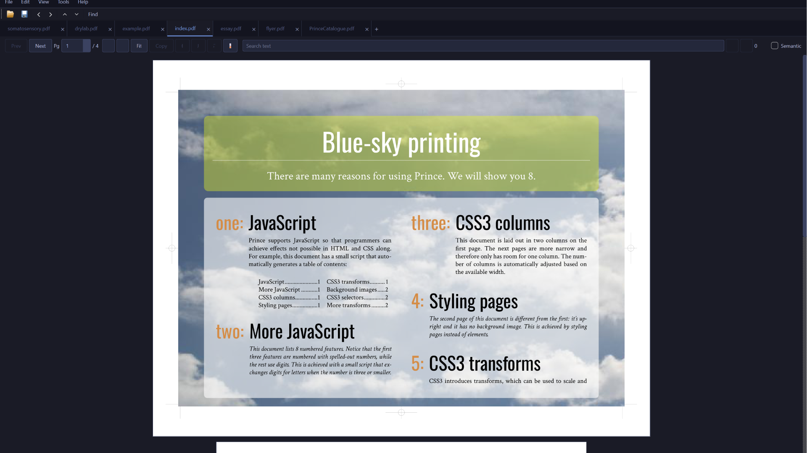
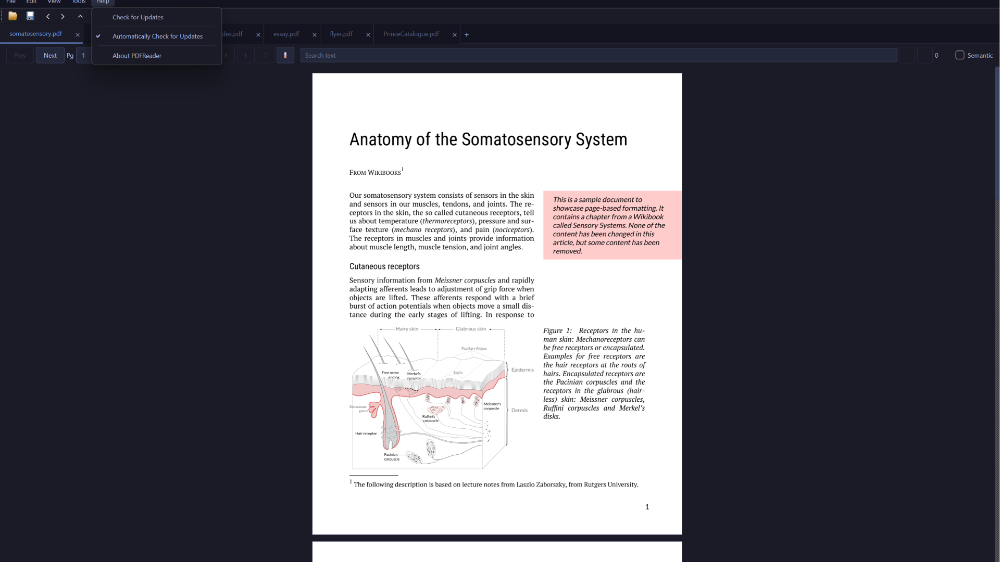
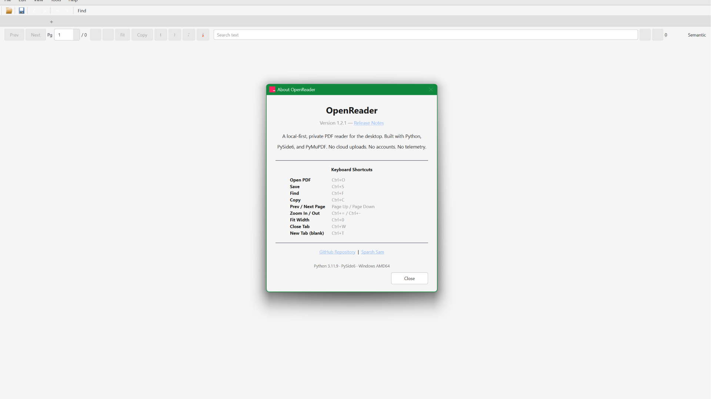

<p align="center">
  
</p>

<h1 align="center">OpenReader</h1>

<p align="center">
  A local-first desktop PDF reader for Windows.
  <br>
  Read, search, copy, merge, split, extract, and compress PDFs without uploading documents anywhere.
</p>

<p align="center">
  <a href="https://github.com/sparshsam/pdfreader-by-sparsh/releases/latest"></a>
  <a href="LICENSE"></a>
  <a href="https://github.com/sparshsam/pdfreader-by-sparsh/actions/workflows/release.yml"></a>
  <a href="https://github.com/sparshsam/pdfreader-by-sparsh/actions/workflows/ci.yml"></a>
  <a href="https://github.com/sparshsam/pdfreader-by-sparsh/actions/workflows/security.yml"></a>
  <a href="https://github.com/sparshsam/pdfreader-by-sparsh/releases"></a>
</p>

<p align="center">
  <a href="#download">Download</a>
  ·
  <a href="#features">Features</a>
  ·
  <a href="#screenshots">Screenshots</a>
  ·
  <a href="#roadmap">Roadmap</a>
  ·
  <a href="#build-from-source">Build</a>
  ·
  <a href="#security-and-privacy">Security</a>
  ·
  <a href="#cryptographic-verification-base">Verification</a>
  ·
  <a href="#future-philosophy">Philosophy</a>
  ·
  <a href="ARCHITECTURE.md">Architecture</a>
  ·
  <a href="VERSIONING.md">Versioning</a>
</p>

## Overview

OpenReader is a **stable, local-first desktop PDF utility** built with Python, PySide6, and PyMuPDF. It is designed for people who want common PDF tasks in a simple native app without sending private documents to a cloud service.

The app is intentionally local-first: PDFs are opened, rendered, searched, merged, split, annotated, and compressed on your computer — no uploads, no accounts, no telemetry.

**v1.2.2** (current release) fixes the MSIX manifest for Microsoft Store acceptance. Windows distribution uses MSIX/App Installer with Windows-native updates — the app never replaces itself. See the [changelog](CHANGELOG.md) and [roadmap](ROADMAP.md) for what's new and what's next.

## Download

Get the latest builds from the [Releases page](https://github.com/sparshsam/pdfreader-by-sparsh/releases/latest).

| Platform | Recommended Download | Alternative | Notes |
|---|---|---|---|
| Windows | `OpenReader.msix` | `OpenReader-Setup.exe` (legacy) or `OpenReader-Windows.zip` | **MSIX (recommended for v1.2.0+):** Windows-managed updates via App Installer. Signed with a future Store identity. No admin required for per-user install when signed. *(Currently unsigned — enable Developer Mode for sideloading.)* **Legacy Setup.exe:** Inno Setup installer, requires admin. ZIP for portable/manual recovery. |
| macOS | — | — | **Not currently stable.** macOS builds are published for source-build testing only. The app may exhibit UI issues, missing features, or crashes. Run from source for the best macOS experience (see [Build From Source](#build-from-source)). |

Windows may show a SmartScreen warning because community builds are not code-signed. macOS may show a Gatekeeper warning because the Mac builds are not Apple-notarized. Only run software from sources you trust.

**About the "Unknown Publisher" warning:** The MSIX package currently displays "Unknown Publisher" because GitHub Release builds are unsigned. The Microsoft Store will sign the package automatically with the Store identity upon submission, removing this warning. For local test-signing, see [test signing setup](docs/msix-update-validation.md#test-signing-setup).

**v1.2.0 update change:** In-app self-updating has been removed. OpenReader now uses **Windows-native updates** — the app never downloads or runs installers.

- **Existing v1.0.x and v1.1.x users** must manually install a v1.2.0+ MSIX once. Future updates are handled by the Microsoft Store or Windows App Installer.
- **v1.2.0+ users:** Windows App Installer manages updates on launch and in the background. The app's Help → Check for Updates opens the GitHub Releases page in your browser.
- Source builds should be updated with `git pull` and rebuilt locally.

> **ℹ️ Microsoft Store-managed updates** will provide automatic updates after Store approval. Until then, users update by downloading the latest MSIX from GitHub Releases and installing manually (Developer Mode required for unsigned packages).

## Features

| Category | Capabilities |
|---|---|
| Reading | Open PDFs, one-page view, previous/next navigation, page jump, fit-width, zoom in/out |
| Multi-tab | Open several documents in a single window with movable, closeable tabs. Ctrl+T new tab, Ctrl+W close tab, Ctrl+Shift+W close all |
| Session restore | Remembers open PDFs and page positions across restarts. Auto or manual restore (File menu toggle) |
| Search (keyword) | Full-document text search, match count, next/previous result navigation (PageUp/PageDown). Ctrl+F to focus |
| Search (semantic) | TF-IDF cosine similarity search across indexed library. Toggle "Semantic" in search bar |
| Library search | SQLite FTS5 full-text index over entire folders. Cross-document search ranked by BM25. Ctrl+Shift+F shortcut |
| PDF comparison | Side-by-side diff with color-coded changes (red delete, green insert) and diff summary |
| Copying | Drag-select text from the visible page and copy with `Ctrl+C` or the Copy button |
| OCR fallback | Attempts OCR-assisted selection on scanned/image-based pages when Tesseract OCR data is available |
| Annotations | Highlight, underline, and strikethrough selected text; sticky notes on any page. Saved as native PDF annotations |
| Annotation management | Show/hide annotations toggle (View menu). Delete all annotations on current page or entire document (Tools menu) |
| Save PDF | Explicit File → Save (Ctrl+S) to persist annotation edits immediately |
| PDF tools | Merge PDFs, split every page, extract page ranges like `1-3,5`, save compressed copies |
| Desktop integration | Windows installer with `.pdf` file association, Start Menu, and desktop shortcut |
| Dark mode | System-aware dark theme (Catppuccin Mocha) with Auto/Light/Dark toggle via View → Theme |
| Recent files | Quick access to the last 10 opened PDFs via File → Open Recent |
| Update detection | Help → Check for Updates queries GitHub API and opens the releases page in a browser. |
| Release engineering | Tag-driven GitHub Release publishing, PyInstaller packaging, Windows/macOS GitHub Actions builds, Inno Setup installer (legacy), MSIX packaging |

## Screenshots

| Reader | Search |
|--------|--------|
|  |  |

| Annotate | Merge & Split |
|-----------|---------------|
|  |  |

| Dark Mode | About |
|------------|-------|
|  |  |

## Why I Built This

I built OpenReader as a local-first alternative for reading and handling PDFs without uploading private documents to cloud services. The project helped me practice desktop GUI development, PDF processing, OCR fallback handling, packaging, release automation, and security hardening while creating a tool people can actually use.

## Security and Privacy

OpenReader processes PDFs locally. It does not use network services and does not upload PDFs.

The app includes lightweight safety checks before opening and rendering documents:

- Accepts `.pdf` files only.
- Checks for a PDF header before parsing.
- Rejects empty files and files over 500 MB.
- Rejects pages outside the supported page-size limit.
- Caps render pixel allocation to reduce PDF-bomb/OOM risk.
- Limits all-pages search result storage.
- Keeps only a small OCR page cache in memory.
- Runs `pip-audit` and Bandit in CI.

These checks reduce risk from malformed or oversized PDFs, but PDF parsing still depends on PyMuPDF/MuPDF. Avoid opening PDFs from untrusted sources unless you use OS-level sandboxing, a VM, or another isolation layer.

## License and Use

OpenReader is free to use, share, study, and modify for non-commercial purposes under the [PolyForm Noncommercial License 1.0.0](LICENSE).

Commercial use, resale, paid redistribution, or bundling in a commercial product is not permitted without separate written permission from the copyright holder.

Earlier published versions may have been released under MIT. The current license applies from the license change forward.

## Requirements

| Use case | Requirements |
|---|---|
| Run Windows release | Windows 10 or newer. Python is not required. |
| Develop/build locally | Python 3.11 or newer. Windows recommended; macOS source builds may work but are not tested. |

## Build From Source

### Windows

```powershell
python -m venv .venv
.\.venv\Scripts\Activate.ps1
python -m pip install -r requirements.txt
python main.py
```

Build the Windows executable:

```powershell
.\scripts\build_windows.ps1
```

Output:

```text
dist\OpenReader\
├── OpenReader.exe
└── _internal\
    ├── python311.dll
    ├── PySide6\
    └── ...
```

### macOS

The Windows `.exe` cannot run on macOS. PyInstaller bundles native binaries for the operating system it runs on.

**macOS packaged builds are not stable.** The app is developed and tested primarily on Windows. To run on macOS, build from source — this gives you the latest code without the packaging layer:

```bash
git clone https://github.com/sparshsam/pdfreader-by-sparsh.git
cd pdfreader-by-sparsh
python3 -m venv .venv
source .venv/bin/activate
pip install -r requirements.txt
python main.py
```

See [docs/macos.md](docs/macos.md) for macOS setup, Finder "Open With" notes, icon generation, and OCR notes.

## Releases and Update Strategy (v1.2.0+)

Release assets are the canonical distribution path. GitHub Actions artifacts are CI outputs and are not release assets.

**Starting with v1.2.0, update detection replaces in-app self-updating.** The app no longer downloads or runs installers. Updates are handled by **Windows App Installer** (via MSIX packaging) or performed manually by the user.

**macOS release assets** (Apple Silicon and Intel ZIPs) are published alongside Windows but **are not stable** — Windows is the tested platform. Mac users should build from source (see [Build From Source](#build-from-source)).

### Update Detection

The app checks for updates via GitHub API:

```text
https://api.github.com/repos/sparshsam/pdfreader-by-sparsh/releases/latest
```

- **Background check (optional):** On launch, the app silently checks for a newer version. If found, a brief status bar message appears.
- **Manual check:** Help → Check for Updates queries the API and shows a dialog with version info and release notes.
- **No download/install:** The dialog offers "Open Releases Page" — the user gets the MSIX from GitHub and installs it manually.
- **Microsoft Store future:** After Store submission, Store-managed automatic updates replace the manual download flow for Store users.

### MSIX Distribution

The recommended Windows distribution format is MSIX, which provides:
- **Windows-managed updates** — App Installer checks on launch and in the background
- **Clean install/uninstall** — no leftover registry keys or files
- **No admin required** — per-user installs don't need elevation (once signed)

**GitHub Release MSIX packages are unsigned** and require Windows Developer Mode for sideloading. After Microsoft Store submission, the Store-signed MSIX will install without Developer Mode and without SmartScreen warnings.

> **⚠️ GitHub MSIX vs Store-signed MSIX:** The unsigned .msix from GitHub Releases is for beta testing only. The Store-signed .msix (delivered through the Microsoft Store) is the production distribution channel. They share the same identity (`SparshSam.OpenReader`) and upgrade chain, so a Store install can upgrade a sideloaded beta and vice versa.

### Legacy Installer

The Inno Setup installer (`installer/setup.iss`) remains available for manual use. It no longer supports in-app update triggering — it exists purely as a standalone installer for users who prefer it.

See [docs/windows-distribution.md](docs/windows-distribution.md) for the full Windows distribution strategy, [docs/updater-architecture.md](docs/updater-architecture.md) for the updater architecture, and [RELEASE.md](RELEASE.md) for release instructions.

## Use as Default PDF App

Windows does not allow apps to silently take over file defaults. To make this your default PDF app:

1. Right-click a PDF file.
2. Choose **Open with > Choose another app**.
3. Pick `OpenReader.exe`.
4. Select **Always use this app to open .pdf files**.
5. Click **OK**.

## OCR Setup

Text selection works natively on PDFs with embedded text. For scanned/image-only PDFs, the app falls back to OCR via PyMuPDF's Tesseract integration.

No OCR setup is needed to read regular PDFs — the app only requires Tesseract when you drag-select text on a scanned page.

### Installing Tesseract

**Windows**
1. Download the installer from [GitHub UB-Mannheim/tesseract](https://github.com/UB-Mannheim/tesseract/releases)
2. Run the installer — check "Add to PATH" during setup
3. Restart the app; OCR will work automatically

**macOS**
```bash
brew install tesseract
```
No restart needed — PyMuPDF finds it automatically.

**Linux (source builds)**
```bash
# Debian / Ubuntu
sudo apt install tesseract-ocr tesseract-ocr-eng

# Fedora
sudo dnf install tesseract tesseract-langpack-eng

# Arch
sudo pacman -S tesseract tesseract-data-eng
```

## Roadmap

### ✓ v0.3.x — Completed (latest: v0.3.6)

**v0.3.0** shipped the major feature set:
- **Workspace and session restoration** — remembers which PDFs were open and what page you were on. Auto-restore on launch (toggle in File menu).
- **Full-library indexed search** — SQLite FTS5-based full-text index over entire folders of PDFs. Manage folders via Library dialog, search across all documents instantly.
- **PDF version comparison** — side-by-side diff view with color-coded changes (red deletions, green insertions). Compares page by page with diff summary.
- **Offline semantic search** — TF-IDF cosine similarity search (no ML dependencies). Toggle "Semantic" checkbox in the search bar for meaning-based matching across your indexed library.
- **Compare button** in toolbar and **Tools → Compare PDFs** menu entry.
- **Library button** in toolbar and **View → Library Search** menu entry with Ctrl+Shift+F shortcut.
- **Semantic search toggle** (checkbox) integrated into the main search bar.

**v0.3.1–v0.3.6** focused on release engineering, installer, and updater reliability:
- Tag-driven GitHub Release publishing workflow with canonical updater asset names
- Windows auto-update fix (lost metadata, save-as-`update_None` resolved)
- Enhanced update error handling with HTTP status-specific messages and debug logging
- Inno Setup installer with dynamic version injection, icon, and proper file association
- CI hardening with compile checks, regression tests, security audit, and asset validation

### ✓ v0.2.0 — Completed

- **Highlight and annotation tools** — select, highlight, underline, and add sticky notes directly on PDFs; saved as native PDF annotations, not overlays
- **Multi-tab PDF support** — open several documents in a single window with tabbed navigation. Ctrl+T new tab, Ctrl+W close tab
- **Dark mode** — system-aware Catppuccin Mocha theme with Auto/Light/Dark toggle (View → Theme)
- **Recent files list** — last 10 documents in File → Open Recent
- **Windows installer** — Inno Setup installer with `.pdf` file association and Start Menu entry
- **OCR setup docs** — per-platform Tesseract installation guide above
- **macOS auto-update** — PID-based process wait, retry logic, Gatekeeper quarantine clearance

### ✓ v1.1.0 — AI Agent Integration (Shipped)

- [x] MCP server for AI agent PDF integration (14 tools)
- [x] README features table synced with code
- [x] README tech stack expanded

### ✓ v1.1.1 — Stability and UX Hardening

- [x] Open file — single picker, no cascading fallbacks, re-entrant guard
- [x] New Tab — creates blank tab without file dialog
- [x] Session restore — "Don't ask again" checkbox with persistent preference
- [x] Compress — size guard rejects output larger than original
- [x] Updater — post-launch version verification with status bar confirmation
- [x] Windows publisher docs — "Unknown Publisher" explained
- [x] 9 new regression tests (28 total, all passing)

### ✓ v1.1.10 — Installer-Based Windows Updater

- [x] Windows in-app updates use `OpenReader-Setup.exe`
- [x] Inno Setup handles UAC elevation and Program Files replacement
- [x] Portable ZIP remains available for manual recovery
- [x] Release workflow requires the Windows installer asset

### ✓ v1.1.11 — Updater Validation Release

- [x] Minimal version-only release to test v1.1.10 → v1.1.11 updater flow
- [x] Confirms Windows updater downloads and launches `OpenReader-Setup.exe`

### ✓ v1.2.0 — MSIX Distribution Reset (Completed)

**Goal:** Replace in-app self-updating with MSIX/App Installer for Windows.

- [x] Remove self-update download/apply pipeline from `main.py`
- [x] Keep safe update detection (Help → Check for Updates → opens releases page)
- [x] Add MSIX packaging (`packaging/msix/`)
- [x] Add App Installer template for Windows-managed updates
- [x] Update GitHub Actions workflow to build MSIX
- [x] Add architecture docs (`docs/windows-distribution.md`, `docs/updater-architecture.md`)
- [x] Validate MSIX install and in-place upgrade (confirmed on Windows 11)
- [x] Store submission — v1.2.1 is the first Microsoft Store release candidate

### Near-Term
Items in active or planned development.

- **Local AI summarization** — generate document summaries and extract key points using a local LLM (e.g. Ollama, llama.cpp); no data ever leaves your machine
- **Stronger sandboxing guidance** — documented approaches for running the app in an OS sandbox when opening documents from untrusted sources

### Long-Term Vision
The direction the project grows into over time — grounded in real engineering, not speculation.

- **Cross-platform desktop support** — native builds for Linux in addition to Windows and macOS, broadening the audience to all major desktop platforms
- **Secure research workspace** — a sandboxed reading environment with isolated rendering, no write access to the rest of the filesystem, and optional network blocking for working with sensitive or untrusted documents
- **PDF timeline and version history** — track changes across document revisions, with a browsable timeline of edits and diffs
- **Plugin system** — a lightweight extension API for community-contributed tools (custom export formats, batch processing pipelines, metadata editors)
- **Collaborative annotations (optional, wallet-based)** — share annotations and highlights between trusted peers using cryptographic identity, not a cloud account

## Cryptographic Verification (Base)

Optional infrastructure for anchoring document fingerprints to the [Base](https://base.org) blockchain. This feature is entirely opt-in — the app functions fully without it.

### Philosophy

PDFs remain local. No document content is ever uploaded or transmitted. Only a cryptographic hash — a fixed-length fingerprint derived from the file — is written to the blockchain. This creates a permanent, publicly verifiable proof that a specific document existed at a specific time, without revealing anything about its contents.

### Planned capabilities

- **Proof-of-existence anchoring** — generate a SHA-256 hash of any PDF and record it on Base in a single low-cost transaction
- **Verification receipts** — the app produces a small local receipt file containing the block number, transaction hash, and document fingerprint, so you can prove a document's existence without re-querying the chain
- **QR verification slips** — print or save a QR code that encodes the verification receipt, allowing anyone with the original PDF to independently confirm it matches the anchored fingerprint
- **Portable proof metadata** — embed verification metadata directly in the PDF as a hidden annotation layer, so proof travels with the document
- **Optional wallet-based identity** — use an Ethereum wallet for signing annotations, allowing trusted collaborators to verify who made a highlight or note without a central account system

### What stays local

- All PDF content
- All rendering, search, and processing
- All AI summarization and semantic search (when enabled)
- All annotation data until a user explicitly anchors a hash or signs with their wallet

Base is used only as a low-cost, permanent verification layer. It is not a data store, not a monetization mechanism, and not a requirement for any core functionality.

## Future Philosophy

OpenReader sits at the intersection of a few ideas that I think are worth building towards:

- **Local-first tools** that work offline, respect your filesystem, and don't require an account
- **Privacy-preserving software** that treats user data as something to protect, not extract
- **Cryptographic proof systems** that let you assert facts about documents without revealing their contents
- **User ownership** — you install it, you run it, you decide what happens to your data
- **Interoperable calm utilities** — small, focused tools that compose well with each other rather than monolithic platforms
- **Optional decentralized infrastructure** — blockchain used as a lightweight verification oracle, not a platform for speculation or lock-in

This project is one piece of that broader picture. The immediate goal is a genuinely good PDF reader. Everything else — the proof layer, the AI features, the cross-platform story — builds on that foundation, never replaces it.

## Project Structure

```text
.
├── .github/                 # CI, security checks, Dependabot
├── assets/                  # App icon and README screenshots
├── docs/                    # Platform notes and known limitations
├── installer/               # Inno Setup installer script
├── scripts/                 # Build scripts
├── tests/                   # Regression test suite
├── tools/                   # Developer utilities and CI test helpers
├── main.py                  # Main PySide6 application
├── pdfreader_lib/           # Core library (search, comparison, MCP server)
├── requirements.txt         # Pinned runtime/build dependencies
├── requirements-mcp.txt     # MCP server dependencies (optional)
├── OpenReader.spec          # PyInstaller spec
├── .bandit                  # Bandit security scanner configuration
├── CHANGELOG.md
├── CONTRIBUTING.md
├── LICENSE
└── SECURITY.md
```

## Contributing

Contributions are welcome for non-commercial use cases. Please read [CONTRIBUTING.md](CONTRIBUTING.md) and [SECURITY.md](SECURITY.md) before opening issues or pull requests.

## AI Agent Integration (MCP Server)

OpenReader ships with a built-in [MCP (Model Context Protocol)](https://modelcontextprotocol.io) server that lets AI agents interact with PDFs programmatically. Agents can read, search, compare, merge, split, compress, and index PDFs — all locally, no cloud involved.

### Available Tools (14)

| Tool | Purpose |
|------|---------|
| `extract_text` | Extract all text from a PDF, per-page |
| `get_page_text` | Extract text from a single page |
| `get_metadata` | Get PDF metadata (title, author, pages, size) |
| `get_page_count` | Get the number of pages |
| `search_pdf` | Search for text within a single PDF |
| `compare_pdfs` | Compare two PDFs page-by-page with diff |
| `merge_pdfs` | Merge multiple PDFs into one |
| `split_pdf` | Split into individual page files |
| `extract_pages` | Extract specific pages by range (e.g. `1-3,5,7-9`) |
| `compress_pdf` | Create a compressed copy |
| `index_folder` | Build SQLite FTS5 full-text index for a folder |
| `search_library` | Search across all indexed PDFs (BM25 ranked) |
| `search_semantic` | TF-IDF meaning-based search across indexed PDFs |
| `list_indexed_docs` | List all documents in the search index |

### Setup

```bash
# Install the MCP SDK
pip install -r requirements-mcp.txt

# For SSE/HTTP transport (optional):
# pip install starlette uvicorn
```

### Agent Configuration

**Claude Code, Hermes Agent, or any MCP-compatible agent:**

Add to your agent's MCP server configuration:

```json
{
  "mcpServers": {
    "pdfreader-by-sparsh": {
      "command": "python",
      "args": ["-m", "pdfreader_lib.mcp_server"]
    }
  }
}
```

### Usage

The server runs over stdio by default (standard for AI agents):

```bash
python -m pdfreader_lib.mcp_server
```

For HTTP/SSE transport (gateway mode):

```bash
python -m pdfreader_lib.mcp_server --transport sse --port 8312
```

### What Agents Can Do

- **Extract text** from PDFs for analysis or summarization
- **Search** across a folder of PDFs using full-text or semantic search
- **Compare** document versions and get structured diffs
- **Merge** multiple PDFs into one document
- **Split** PDFs by page or extract specific page ranges
- **Compress** PDFs to reduce file size
- **Index** entire folders for cross-document search

All operations are local. No data is uploaded anywhere.

---

*Last updated: June 2026*

## Tech Stack

| Layer | Choice |
|-------|--------|
| Language | Python 3.11+ |
| UI Framework | PySide6 (Qt 6) |
| PDF Rendering | PyMuPDF (MuPDF) |
| Search | SQLite FTS5 (keyword), TF-IDF / scikit-learn (semantic) |
| OCR | PyMuPDF / Tesseract integration |
| Packaging | PyInstaller (onedir) |
| Installer (Windows) | Inno Setup |
| CI/CD | GitHub Actions (Windows + macOS) |
| Security scanning | Bandit, pip-audit |
| Platform | Windows (primary — stable), macOS (source-build only — not stable) |
